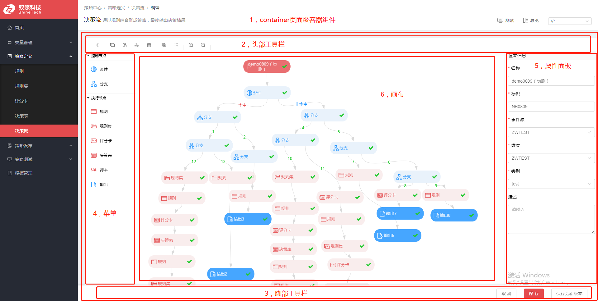

#决策流

##一，组件化设计

##二，实现方案
- 画布方面采用独立的前端工程独立运（提高了扩展性，日后有其他系统引用时，可以做成npm模块插件使用）
- 主工程引用画布工程，通过iframe嵌套，父子窗口之间通过H5的新API postMessage来进行双工通讯
- 公用数据存放在sessionStorage中

##三，操作和处理逻辑

1. 修改画布的配置信息时候，同时向父窗口发送信息，父工程通过传递的信息进行相关组件的渲染工作。
2. 点每次单击或者双击画布的节点时候，向父窗口发送信息, 父工程通过信息的类型字段判断单击，双击，删除等动作，再根据类型节点类型，注入新数据同时展示属性面板或者弹窗信息面板。

##四，通讯字典
###1，父工程
- demo

		{
		    "code": 0,
			"value":{
				"name": '节点的类型'，
				"data": '节点的配置信息'，
				...
			}
		}

<table border="1">
  <tr>
    <th>code值</th>
	<th>表示的动作事件类型</th>
  </tr>
  <tr>
    <td>0</td>
    <td>单击</td>
  </tr>
  <tr>
    <td>1</td>
    <td>双击</td>
  </tr>
  <tr>
    <td>2</td>
    <td>删除</td>
  </tr>
</table>

<table border="1">
  <tr>
    <th>value.name（单击时）</th>
	<th>节点类型</th>
  </tr>
  <tr>
    <td>start</td>
    <td>开始</td>
  </tr>
  <tr>
    <td>control</td>
    <td>条件控制</td>
  </tr>
  <tr>
    <td>rule</td>
    <td>规则</td>
  </tr>
  <tr>
    <td>ruleSet</td>
    <td>规则集</td>
  </tr>
  <tr>
    <td>scoreCard</td>
    <td>评分卡</td>
  </tr>
  <tr>
    <td>decisionTable</td>
    <td>决策表</td>
  </tr>
  <tr>
    <td>sql</td>
    <td>脚本</td>
  </tr>
  <tr>
    <td>output</td>
    <td>输出</td>
  </tr>
  <tr>
    <td>branch</td>
    <td>分支</td>
  </tr>
  <tr>
    <td rowspan="3">linker</td>
    <td rowspan="3">连线</td>
    <th>data.type</th>
    <th>连线类型</th>
  </tr>
  <tr>
    <td>control</td>
    <td>表示是条件控制节点的连线</td>
  </tr>
  <tr>
    <td>branch</td>
    <td>表示是分支的连线</td>
  </tr>
</table>

<table border="1">
  <tr>
    <th>value.name（双击时）</th>
	<th>节点类型</th>
  </tr>
  <tr>
    <td>control</td>
    <td>条件节点的弹窗面板</td>
  </tr>
  <tr>
    <td>output</td>
    <td>输出节点的弹窗面板</td>
  </tr>
  <tr>
    <td>rule</td>
    <td>规则节点的弹窗面板</td>
  </tr>
  <tr>
    <td>ruleSet</td>
    <td>规则集节点的弹窗面板</td>
  </tr>
  <tr>
    <td>scoreCard</td>
    <td>评分卡节点的弹窗面板</td>
  </tr>
  <tr>
    <td>decisionTable</td>
    <td>决策表节点的弹窗面板</td>
  </tr>
  <tr>
    <td>sql</td>
    <td>脚本节点的弹窗面板</td>
  </tr>
  <tr>
    <td rowspan="3">linker</td>
    <td rowspan="3">连线</td>
    <th>data.type</th>
    <th>连线类型</th>
  </tr>
  <tr>
    <td>branch</td>
    <td>分支的连线的弹窗面板</td>
  </tr>
</table>

###2，子工程（画布）

- demo

		{
		    "code": 0,
			"value": "工具栏方法类型"
		}

<table border="1">
  <tr>
    <th>code值</th>
	<th>表示的事件类型</th>
  </tr>
  <tr>
    <td>0</td>
    <td>更新画布UI数据</td>
  </tr>
  <tr>
    <td>1</td>
    <td>工具栏方法触发</td>
  </tr>
  <tr>
    <td>2</td>
    <td>开启详情模式（隐藏操作菜单）</td>
  </tr>
  <tr>
    <td>3</td>
    <td>开启决策路径模式</td>
  </tr>
</table>

<table border="1">
  <tr>
    <th>value（工具栏方法触发）</th>
	<th>方法类型</th>
  </tr>
  <tr>
    <td>undo</td>
    <td>撤销</td>
  </tr>
  <tr>
    <td>redo</td>
    <td>重做</td>
  </tr>
  <tr>
    <td>copy</td>
    <td>复制</td>
  </tr>
  <tr>
    <td>paste</td>
    <td>粘贴</td>
  </tr>
  <tr>
    <td>cut</td>
    <td>剪切</td>
  </tr>
  <tr>
    <td>delete</td>
    <td>删除</td>
  </tr>
  <tr>
    <td>selectAll</td>
    <td>全选</td>
  </tr>
  <tr>
    <td>duplicate</td>
    <td>副本</td>
  </tr>
  <tr>
    <td>zoomIn</td>
    <td>放大画布</td>
  </tr>
  <tr>
    <td>zoomOut</td>
    <td>缩小画布</td>
  </tr>
</table>
