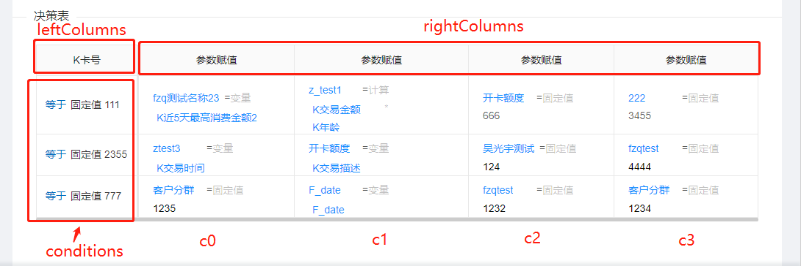
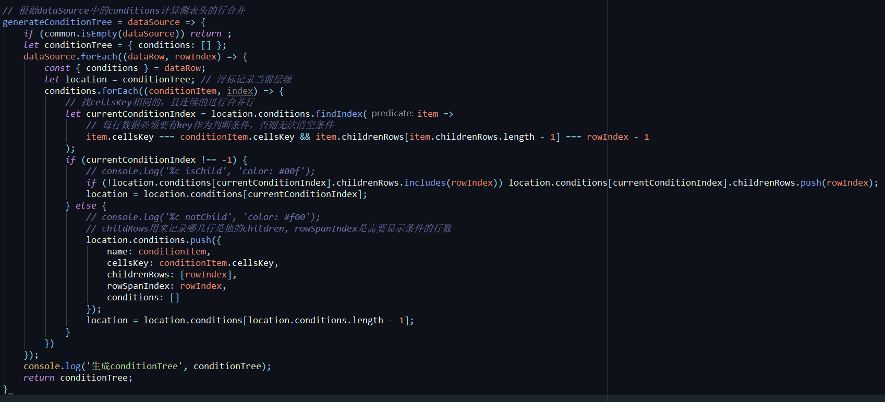
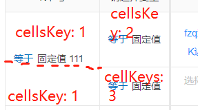
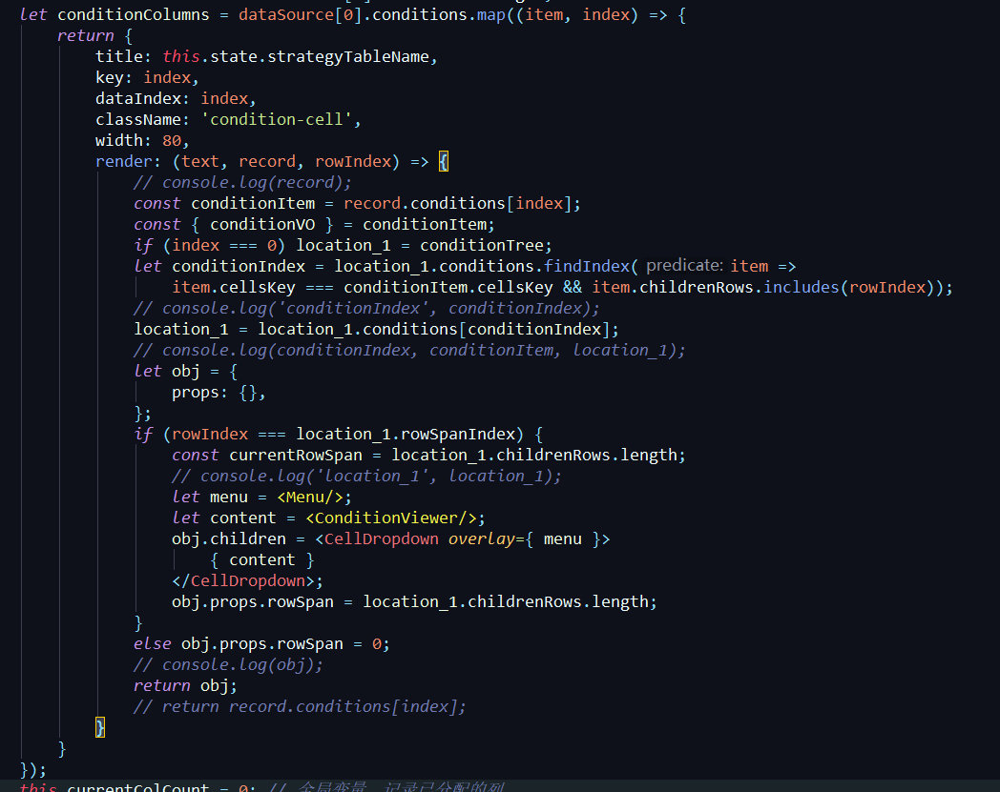
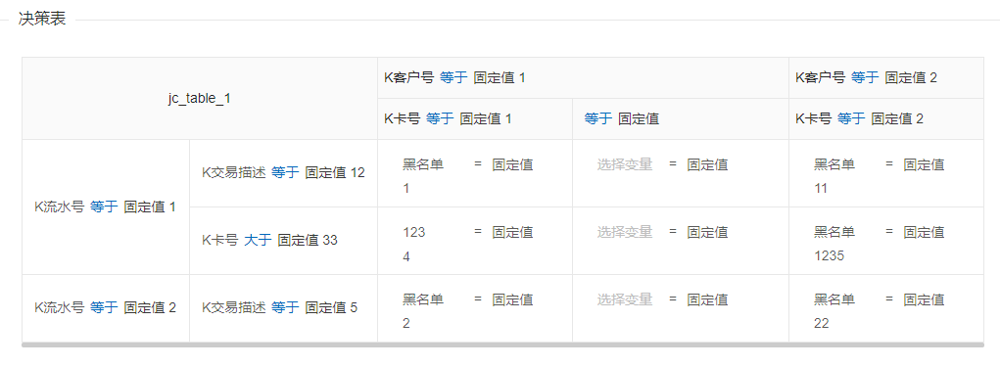
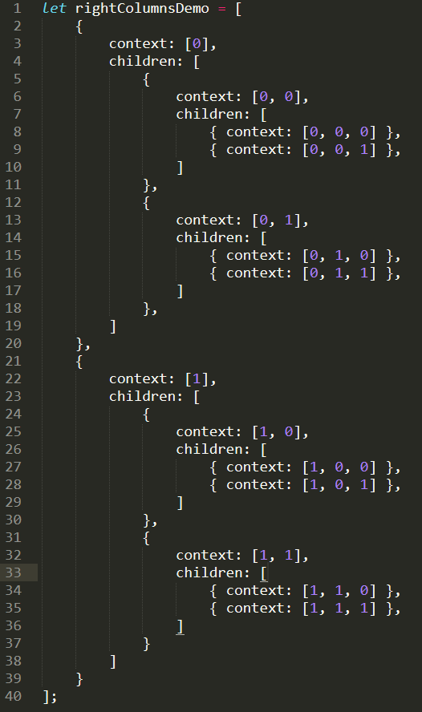

#决策表

##表格的逻辑

决策表分为简单决策表和交叉决策表，跟普通表格不一样的地方在于左侧有至少一列的侧表头，而且侧表头的单元格是允许行合并来展示层级关系。
决策表是基于ant design的Table组件，左边侧表头的行合并叫rowSpan，表头右边的列合并叫colSpan。Table的两个主要参数是columns和dataSource，columns类似配置，如何显示每一列的表头、绑定什么数据、以及控制内容的渲染（包括内容的行合并），一般表格只要指定dataIndex就可以显示对应的数据了，但是因为决策表左侧的表头（实际上是伪表头）是动态的，所以决策表需要根据内容去生成columns（主要是columns的条件列部分）。



首先，先根据表格内容的conditions生成conditionTree（对应代码里的generateConditionTree方法)，最后生成的就是一个树状的条件对象，包含了每个条件的行合并数（childRows的长度），以及行合并开始的行index，后面生成columns会用到



先遍历dataSource的每一行，然后根据每一行的conditions与之前的conditions去对比，如果这一行对应到前面同一列的cellsKey相同，则conditionTree对应位置的childRow加上这一行的index，childRow的长度也就是行合并数



然后就可以根据这个conditionTree生成leftColumns，leftColumns + rightColumns就是Table的columns参数



这里每一行渲染的时候都要去根据conditionTree去设置这个单元格的属性，rowSpan行合并n行是n，不显示是0。



表格条件列的改动也是围绕cellsKey进行，添加的行如果想让他的上一行合并，就给他赋值相同的cellsKey。最后更新表格时候，一般是不可以直接更新dataSource的，因为更新dataSource之后，原来的conditionTree与现在的数据就对不上了，所以要重新走一遍刚才的流程（这些流程封装到一个方法里，对应代码里的updateColumns），这个方法会根据新的dataSource、leftColumns、rightColumns重新生成cloumns，最后再更新表格的columns和dataSource。

##表格的使用
跟普通的Table没什么区别，行合并部分理解为多行，动作列部分都是独立的行跟列，更新时候需要用updateColumns。

##交叉决策表和简单决策表的区别
左侧一样，区别是动作列（rightColumns），动作列的对应的表头（columns的右边部分），如果是两行以上的，每一个是树状的数据，需要递归生成并赋值context（跟规则配置的Tree组件的nodeKey原理一样，对表头操作的时候要用到，就是这个单元格在这个对象中的每个children的index组合，这个是简单的例子



有了这个就可以从树状数据中定位这个单元格），给最后一行的单元格分配key和dataIndex（就是这个表头单元格对应的表格内容列）



##表格数据的更新
现在是通过inject(‘store’)，在更新表格数据的同时，将表格数据更新到store，保存时候就可以从store中获取这些数据然后转化为保存的格式。

