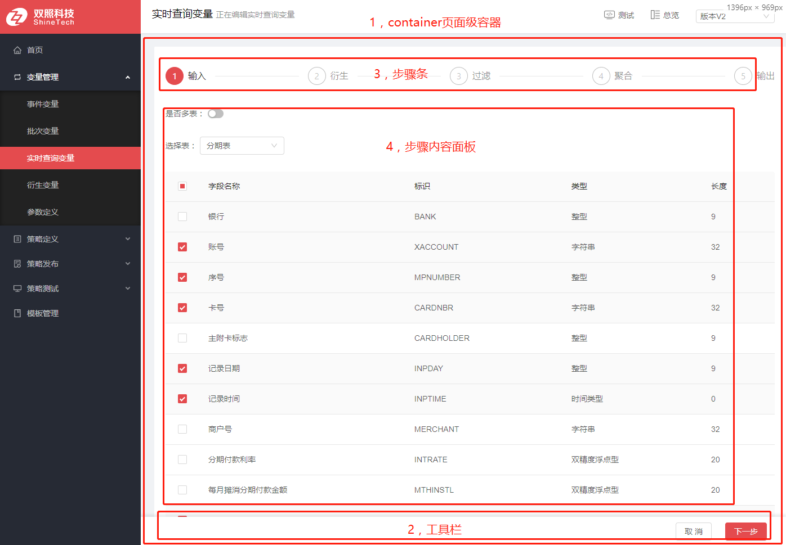
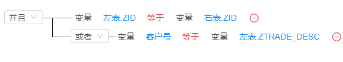
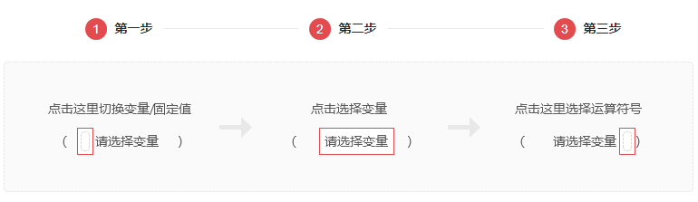

<!--
 * @Description: 略
 * @Author: 曾子建
 * @Date: 2019-08-10 10:27:35
 * @LastEditTime: 2019-08-15 15:10:44
 * @LastEditors:曾子建
 -->

#实时查询变量

##一，组件化设计

##二，操作和处理逻辑

1. 从基础信息页面保存后跳转到设计主页
2. 设计主页每一个步骤都是分开调用后端api来保存步骤信息。
3. 每一次删除或者修改步骤内容的相关元素时候，都会检测其他步骤是否有被引用到，如果有引用到则提示先把引用去除再进行此处的操作。

##三，关键组件
###1，条件组件

- 组件使用

直接引用TreePanel，并且传入相关的属性参数即可。

- 组件构成

TreePanel 和 Tree

- 组件关系

TreePanel是组件的主面板，Tree是TreePanel里面的一个个条件元素组件，Tree通过递归渲染实现

####TreePanel组件
- 属性
<table border="1">
  <tr>
    <th>属性名称</th>
	<th>属性说明</th>
    <th>数据类型</th>
	<th>是否必须</th>
	<th>默认值</th>
  </tr>
  <tr>
    <td>treeData</td>
    <td>条件数据（可以是非状态管理的数据）</td>
    <td>object</td>
    <td>是</td>
    <td>conditionVODemo对象</td>
  </tr>
  <tr>
    <td>updateConditionTree</td>
    <td>回调函数：更新treeData,形参是完整的treeData</td>
    <td>func</td>
    <td>是</td>
    <td></td>
  </tr>
  <tr>
    <td>conditionComplete</td>
    <td>回调函数：所有条件完成后出发的回调函数/td>
    <td>func</td>
    <td>否</td>
    <td></td>
  </tr>
  <tr>
    <td>conditionInComplete</td>
    <td>回调函数：一旦有条件出现未完成后触发/td>
    <td>func</td>
    <td>否</td>
    <td></td>
  </tr>
  <tr>
    <td>disabled</td>
    <td>是否禁止编辑</td>
    <td>bool</td>
    <td>否</td>
    <td>false</td>
  </tr>
  <tr>
    <td>entityType</td>
    <td>实体类型（0衍生变量，1实时查询变量，2规则，3策略，4决策表，5评分卡）</td>
    <td>number</td>
    <td>否</td>
    <td>1</td>
  </tr>
  <tr>
    <td>eventSourceId</td>
    <td>事件源id</td>
    <td>string</td>
    <td>否</td>
    <td>''</td>
  </tr>
  <tr>
    <td>dimensionId</td>
    <td>事件源id</td>
    <td>string</td>
    <td>否</td>
    <td>''</td>
  </tr>
  <tr>
    <td>fieldList</td>
    <td>数据库字段列表（用于下拉选择）</td>
    <td>array</td>
    <td>否</td>
    <td>[]</td>
  </tr>
  <tr>
    <td>type</td>
    <td>条件类型（common通用类型，having类型）</td>
    <td>string</td>
    <td>否</td>
    <td>common</td>
  </tr>
  <tr>
    <td>extraType</td>
    <td>扩展类型（easyStrategyTable简单决策表， crossTable交叉决策表, connect连接条件）</td>
    <td>string</td>
    <td>否</td>
    <td></td>
  </tr>
</table>

- TreePanel任务

1：调用服务端api获取条件的下拉选择数据 。2：增删改查条件事件处理。3：递归渲染条件tree

####Tree组件
- 属性
<table border="1">
  <tr>
    <th>属性名称</th>
	<th>属性说明</th>
    <th>数据类型</th>
	<th>是否必须</th>
	<th>默认值</th>
  </tr>
  <tr>
    <td>type</td>
    <td>由父组件传递</td>
    <td>略</td>
    <td>略</td>
    <td>略</td>
  </tr>
  <tr>
    <td>extraType</td>
    <td>由父组件传递</td>
    <td>略</td>
    <td>略</td>
    <td>略</td>
  </tr>
  <tr>
    <td>disabled</td>
    <td>由父组件传递</td>
    <td>略</td>
    <td>略</td>
    <td>略</td>
  </tr>
  <tr>
    <td>updateConditionTree</td>
    <td>由父组件传递</td>
    <td>略</td>
    <td>略</td>
    <td>略</td>
  </tr>
  <tr>
    <td>verifyConditionTreeFinish</td>
    <td>由父组件传递</td>
    <td>略</td>
    <td>略</td>
    <td>略</td>
  </tr>
  <tr>
    <td>add</td>
    <td>由父组件传递（添加节点方法）</td>
    <td>略</td>
    <td>略</td>
    <td>略</td>
  </tr>
  <tr>
    <td>sub</td>
    <td>由父组件传递（删除节点方法）</td>
    <td>略</td>
    <td>略</td>
    <td>略</td>
  </tr>
  <tr>
    <td>p_relType</td>
    <td>父组件的关系类型</td>
    <td>number</td>
    <td>是</td>
    <td>null</td>
  </tr>
  <tr>
    <td>node</td>
    <td>条件节点的数据</td>
    <td>object</td>
    <td>是</td>
    <td>{}</td>
  </tr>
  <tr>
    <td>nodeKey</td>
    <td>条件节点的唯一层级标识</td>
    <td>number，string</td>
    <td>是</td>
    <td>''</td>
  </tr>
  <tr>
    <td>conditionVODemo</td>
    <td>条件模板</td>
    <td>object</td>
    <td>是</td>
    <td>''</td>
  </tr>
  <tr >
    <td>VAR_SELECTION_ALL</td>
    <td>common下拉选择数据（字符串类型）</td>
    <td>array</td>
    <td>是</td>
    <td>[]</td>
  </tr>
  <tr >
    <td>VAR_SELECTION_DECIMAL</td>
    <td>common下拉选择数据（单双精度类型）</td>
    <td>array</td>
    <td>是</td>
    <td>[]</td>
  </tr>
  <tr >
    <td>VAR_SELECTION_INTEGER</td>
    <td>common下拉选择数据（整型，长整型）</td>
    <td>array</td>
    <td>是</td>
    <td>[]</td>
  </tr>
  <tr >
    <td>VAR_SELECTION_NUMBER</td>
    <td>common下拉选择数据（浮点型）</td>
    <td>array</td>
    <td>是</td>
    <td>[]</td>
  </tr>
  <tr >
    <td>VAR_SELECTION_TIMESTAMP</td>
    <td>common下拉选择数据（时间类型）</td>
    <td>array</td>
    <td>是</td>
    <td>[]</td>
  </tr>
  <tr >
    <td>VAR_SELECTION_VARCHAR</td>
    <td>common下拉选择数据（变量类型）</td>
    <td>array</td>
    <td>是</td>
    <td>[]</td>
  </tr>
  <tr >
    <td>expressionCategoryType</td>
    <td>common下拉选择数据（值类别）</td>
    <td>array</td>
    <td>是</td>
    <td>[]</td>
  </tr>
  <tr >
    <td>expressionVarType</td>
    <td>common下拉选择数据（变量类型）</td>
    <td>array</td>
    <td>是</td>
    <td>[]</td>
  </tr>
  <tr >
    <td>functionComputeType</td>
    <td>common下拉选择数据（函数计算类型）</td>
    <td>array</td>
    <td>是</td>
    <td>[]</td>
  </tr>
  <tr >
    <td>optTypeList</td>
    <td>common下拉选择数据（操作的比较类型）</td>
    <td>array</td>
    <td>是</td>
    <td>[]</td>
  </tr>
  <tr >
    <td>LEFT_VAR_SELECTION</td>
    <td>having下拉选择数据（左变量选择）</td>
    <td>array</td>
    <td>是</td>
    <td>[]</td>
  </tr>
  <tr >
    <td>LEFT_FUN_SELECTION</td>
    <td>having下拉选择数据（左函数选择）</td>
    <td>array</td>
    <td>是</td>
    <td>[]</td>
  </tr>
  <tr >
    <td>RIGHT_VAR_SELECTION_ALL</td>
    <td>having下拉选择数据（右字符串类型）</td>
    <td>array</td>
    <td>是</td>
    <td>[]</td>
  </tr>
  <tr >
    <td>RIGHT_VAR_SELECTION_DECIMAL</td>
    <td>having下拉选择数据（右单双精度类型）</td>
    <td>array</td>
    <td>是</td>
    <td>[]</td>
  </tr>
  <tr >
    <td>RIGHT_VAR_SELECTION_INTEGER</td>
    <td>having下拉选择数据（右整型，长整型）</td>
    <td>array</td>
    <td>是</td>
    <td>[]</td>
  </tr>
  <tr >
    <td>RIGHT_VAR_SELECTION_NUMBER</td>
    <td>having下拉选择数据（右浮点型）</td>
    <td>array</td>
    <td>是</td>
    <td>[]</td>
  </tr>
  <tr >
    <td>RIGHT_VAR_SELECTION_TIMESTAMP</td>
    <td>having下拉选择数据（右时间类型）</td>
    <td>array</td>
    <td>是</td>
    <td>[]</td>
  </tr>
  <tr >
    <td>RIGHT_VAR_SELECTION_VARCHAR</td>
    <td>having下拉选择数据（右变量类型）</td>
    <td>array</td>
    <td>是</td>
    <td>[]</td>
  </tr>
  <tr >
    <td>functionAggType</td>
    <td>having下拉选择数据（having函数）</td>
    <td>array</td>
    <td>是</td>
    <td>[]</td>
  </tr>
  <tr >
    <td>leftExpressionCategoryType</td>
    <td>having下拉选择数据（左值类别）</td>
    <td>array</td>
    <td>是</td>
    <td>[]</td>
  </tr>
  <tr >
    <td>leftExpressionVarType</td>
    <td>having下拉选择数据（左变量类型）</td>
    <td>array</td>
    <td>是</td>
    <td>[]</td>
  </tr>
  <tr >
    <td>rightExpressionCategoryType</td>
    <td>having下拉选择数据（右值类别）</td>
    <td>array</td>
    <td>是</td>
    <td>[]</td>
  </tr>
  <tr >
    <td>rightExpressionVarType</td>
    <td>having下拉选择数据（右值类别）</td>
    <td>array</td>
    <td>是</td>
    <td>[]</td>
  </tr>
</table>

- Tree任务

1：根据条件数据渲染条件 。2：自身条件事件处理。3：管理自身形态

---

###2，计算变量组件

- 操作指引

- 组件构成

Panel 和 Cell

- 组件关系

Panel是组件的主面板，Cell是Panel里面的一个个计算表达式的元素组件，Cell通过递归渲染实现

####Panel组件
- 属性

<table border="1">
  <tr>
    <th>属性名称</th>
	<th>属性说明</th>
    <th>数据类型</th>
	<th>是否必须</th>
	<th>默认值</th>
  </tr>
  <tr>
    <td>entityType</td>
    <td>实体类型（1实时查询变量，2规则，3策略）</td>
    <td>number</td>
    <td>是</td>
    <td>1</td>
  </tr>
  <tr>
    <td>fieldList</td>
    <td>数据库字段列表（用于下拉选择）</td>
    <td>array</td>
    <td>否</td>
    <td>[]</td>
  </tr>
  <tr>
    <td>eventSourceId</td>
    <td>事件源id</td>
    <td>string</td>
    <td>否</td>
    <td>''</td>
  </tr>
  <tr>
    <td>dimensionId</td>
    <td>维度id</td>
    <td>string</td>
    <td>否</td>
    <td>''</td>
  </tr>
  <tr>
    <td>computeExpressionVO</td>
    <td>计算表达式VO</td>
    <td>object</td>
    <td>是</td>
    <td>computeExpressionVODemo</td>
  </tr>
  <tr>
    <td>update</td>
    <td>更新computeExpressionVO</td>
    <td>func</td>
    <td>是</td>
    <td></td>
  </tr>
</table>

- Panel任务

1：调用服务端api获取条计算表达式的下拉选择数据 。2：增删改查表达式事件处理。3：递归渲染Cell组件

####Cell组件
- 属性

<table border="1">
  <tr>
    <th>属性名称</th>
	<th>属性说明</th>
    <th>数据类型</th>
	<th>是否必须</th>
	<th>默认值</th>
  </tr>
  <tr>
    <td>vo</td>
    <td>单条计算表达式VO（computeExpressionVO）</td>
    <td>object</td>
    <td>是</td>
    <td>computeExpressionVODemo</td>
  </tr>
  <tr>
    <td>add</td>
    <td>增加一条表达式</td>
    <td>func</td>
    <td>是</td>
    <td></td>
  </tr>
  <tr>
    <td>sub</td>
    <td>删除一条表达式</td>
    <td>func</td>
    <td>是</td>
    <td></td>
  </tr>
  <tr>
    <td>changeOpt</td>
    <td>修改运算符</td>
    <td>func</td>
    <td>是</td>
    <td></td>
  </tr>
  <tr>
    <td>changeCate</td>
    <td>修改表达式类型</td>
    <td>func</td>
    <td>是</td>
    <td></td>
  </tr>
  <tr>
    <td>changeData</td>
    <td>修改表达式值</td>
    <td>func</td>
    <td>是</td>
    <td></td>
  </tr>
  <tr>
    <td>VAR_SELECTION</td>
    <td>变量下拉选择</td>
    <td>array</td>
    <td>是</td>
    <td>[]</td>
  </tr>
  <tr>
    <td>expressionHead</td>
    <td>是否表达式括号的首部vo</td>
    <td>bool</td>
    <td>是</td>
    <td>false</td>
  </tr>
  <tr>
    <td>expressionTail</td>
    <td>是否表达式括号的尾部vo</td>
    <td>bool</td>
    <td>是</td>
    <td>false</td>
  </tr>
  <tr>
    <td>nullList</td>
    <td>是否空表达式（用于控制形态显示）</td>
    <td>bool</td>
    <td>是</td>
    <td>false</td>
  </tr>
</table>

- Cell任务

1：根据表达式数据渲染表达式 。2：自身表达式的事件处理。3：管理自身形态