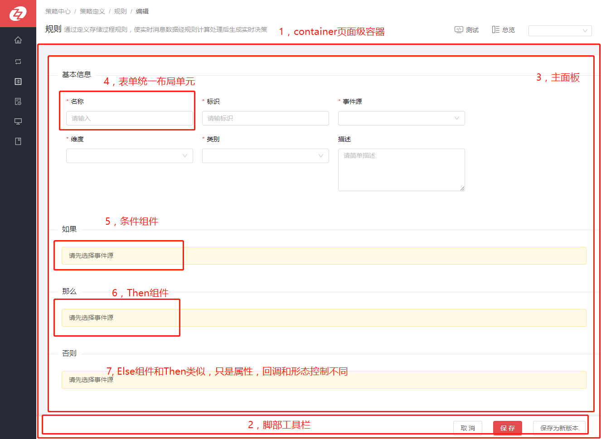
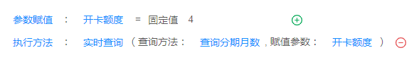

#规则

##一，组件化设计

##二，操作和处理逻辑
- 基本信息采用普通表单控件实现双向绑定
- “如果”， “那么”， “否则”采用独立的公共组件，根据传入的事件源和维度获取组件私有数据。

##三，关键组件
###1，“如果”组件   （条件组件）

- 详见【实时查询变量】第三第1条

###2, “那么”组件

- 组件使用

直接引用ThenPanel，并且传入相关的属性参数即可。

- 组件构成

ThenPanel 和 Then

- 组件关系

ThenPanel是组件的主面板，Then是ThenPanel里面的一个个条件元素组件，Then通过数组循环渲染实现

####ThenPanel组件
- 属性
<table border="1">
  <tr>
    <th>属性名称</th>
	<th>属性说明</th>
    <th>数据类型</th>
	<th>是否必须</th>
	<th>默认值</th>
  </tr>
  <tr>
    <td>treeData</td>
    <td>条件数据（可以是非状态管理的数据）</td>
    <td>object</td>
    <td>是</td>
    <td>conditionVODemoThen对象</td>
  </tr>
  <tr>
    <td>updateConditionThen</td>
    <td>回调函数：更新treeData,形参是完整的treeData</td>
    <td>func</td>
    <td>是</td>
    <td></td>
  </tr>
  <tr>
    <td>conditionComplete</td>
    <td>回调函数：所有条件完成后出发的回调函数/td>
    <td>func</td>
    <td>否</td>
    <td></td>
  </tr>
  <tr>
    <td>disabled</td>
    <td>是否禁止编辑</td>
    <td>bool</td>
    <td>否</td>
    <td>false</td>
  </tr>
  <tr>
    <td>eventSourceId</td>
    <td>事件源id</td>
    <td>string</td>
    <td>否</td>
    <td>''</td>
  </tr>
  <tr>
    <td>dimensionId</td>
    <td>事件源id</td>
    <td>string</td>
    <td>否</td>
    <td>''</td>
  </tr>
</table>

- ThenPanel任务

1：调用服务端api获取条件的下拉选择数据 。2：增删改查条件事件处理。3：循环渲染条件Then

####Then组件
- 属性
<table border="1">
  <tr>
    <th>属性名称</th>
	<th>属性说明</th>
    <th>数据类型</th>
	<th>是否必须</th>
	<th>默认值</th>
  </tr>
  <tr>
    <td>disabled</td>
    <td>由父组件传递</td>
    <td>略</td>
    <td>略</td>
    <td>略</td>
  </tr>
  <tr>
    <td>updateConditionThen</td>
    <td>由父组件传递</td>
    <td>略</td>
    <td>略</td>
    <td>略</td>
  </tr>
  <tr>
    <td>verifyConditionTreeFinish</td>
    <td>由父组件传递</td>
    <td>略</td>
    <td>略</td>
    <td>略</td>
  </tr>
  <tr>
    <td>add</td>
    <td>由父组件传递（添加节点方法）</td>
    <td>略</td>
    <td>略</td>
    <td>略</td>
  </tr>
  <tr>
    <td>sub</td>
    <td>由父组件传递（删除节点方法）</td>
    <td>略</td>
    <td>略</td>
    <td>略</td>
  </tr>
  <tr>
    <td>node</td>
    <td>节点的数据</td>
    <td>object</td>
    <td>是</td>
    <td>{}</td>
  </tr>
  <tr>
    <td>nodeKey</td>
    <td>节点的唯一标识</td>
    <td>number，string</td>
    <td>是</td>
    <td>''</td>
  </tr>
  <tr>
    <td>extraType</td>
    <td>扩展类型（easyStrategyTable简单决策表， crossTable交叉决策表）</td>
    <td>string</td>
    <td>否</td>
    <td></td>
  </tr>
  <tr >
    <td>VAR_SELECTION_ALL</td>
    <td>变量的下拉选择数据（字符串类型）</td>
    <td>array</td>
    <td>是</td>
    <td>[]</td>
  </tr>
  <tr >
    <td>VAR_SELECTION_NUMBER</td>
    <td>变量的下拉选择数据（浮点型,整型）</td>
    <td>array</td>
    <td>是</td>
    <td>[]</td>
  </tr>
  <tr >
    <td>VAR_SELECTION_TIMESTAMP</td>
    <td>变量的下拉选择数据（时间类型）</td>
    <td>array</td>
    <td>是</td>
    <td>[]</td>
  </tr>
  <tr >
    <td>VAR_SELECTION_VARCHAR</td>
    <td>变量的下拉选择数据（变量类型）</td>
    <td>array</td>
    <td>是</td>
    <td>[]</td>
  </tr>
  <tr >
    <td>PARAMS_VAR_SELECTION_ALL</td>
    <td>参数的下拉选择数据（字符串类型）</td>
    <td>array</td>
    <td>是</td>
    <td>[]</td>
  </tr>
  <tr >
    <td>PARAMS_VAR_SELECTION_NUMBER</td>
    <td>参数的下拉选择数据（浮点型,整型）</td>
    <td>array</td>
    <td>是</td>
    <td>[]</td>
  </tr>
  <tr >
    <td>PARAMS_VAR_SELECTION_TIMESTAMP</td>
    <td>参数的下拉选择数据（时间类型）</td>
    <td>array</td>
    <td>是</td>
    <td>[]</td>
  </tr>
  <tr >
    <td>PARAMS_VAR_SELECTION_VARCHAR</td>
    <td>参数的下拉选择数据（变量类型）</td>
    <td>array</td>
    <td>是</td>
    <td>[]</td>
  </tr>
</table>

- Then任务

1：根据数据渲染参数赋值或者执行方法 。2：自身条件事件处理。3：自身状态管理

---

###3, “否则”组件

- 组件使用

直接引用ElsePanel，并且传入相关的属性参数即可。

- 组件构成

ElsePanel 和 Else

- 组件关系

ElsePanel是组件的主面板，Else是ElsePanel里面的一个个条件元素组件，Else通过数组循环渲染实现

####ElsePanel组件
- 属性

同上ThenPanel属性

- ElsePanel任务

1：调用服务端api获取条件的下拉选择数据 。2：增删改查条件事件处理。3：循环渲染条件Else

####Else组件
- 属性

同上Else属性

- Else任务

1：根据数据渲染参数赋值或者执行方法 。2：自身条件事件处理。3：自身状态管理

---